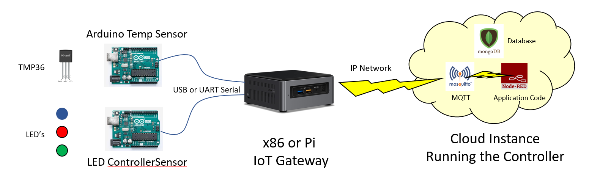

# Software Engineering
# Simple IoT Gateway Example

nuc1gatewayflows.json

The above file contains flows for reading a temperature sensor connected to an Arduino.
This json file contains 3 flows.  These should be deployed to an IoT Gateway device running Node Red.

